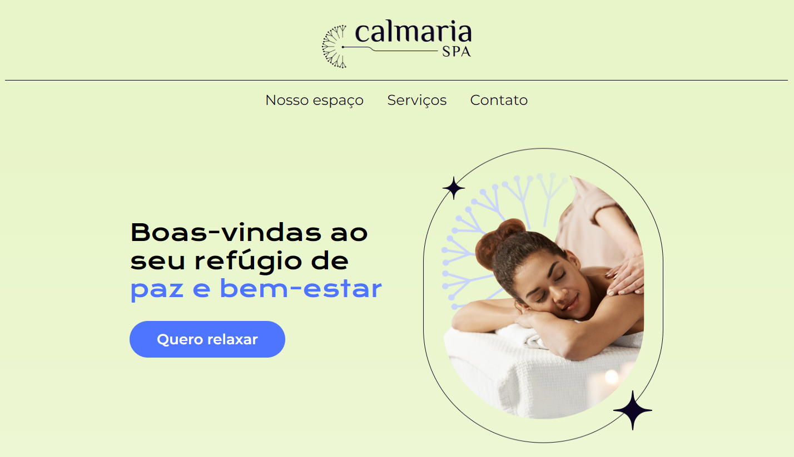

# 🌿 Calmaria Spa

> Um refúgio digital de bem-estar e saúde focado em Acessibilidade Web, design responsivo e estruturação CSS modular.

<p align="center">
  
</p>

---

## 🌐 Acesse o Projeto

O projeto está publicado e pode ser acessado diretamente através do GitHub Pages:
👉 **[https://josefelisbino.github.io/Calmaria-Spa/](https://josefelisbino.github.io/Calmaria-Spa/)**

---

## 📝 Descrição do Projeto

O **Calmaria Spa** é uma landing page desenvolvida para uma empresa fictícia de saúde e bem-estar. A aplicação foi idealizada para proporcionar uma experiência de navegação agradável, relaxante e harmoniosa.

Este repositório foi construído no âmbito dos cursos de Acessibilidade Web da **Alura**, onde o objetivo central é identificar pontos de melhoria no código HTML/CSS e refatorá-los para tornar a aplicação completamente acessível a todas as pessoas usuárias, garantindo conformidade com as diretrizes da Web Accessibility (a11y).

---

## 🎯 Objetivos do Projeto

- ♿ **Acessibilidade Digital (a11y)**: Garantir acessibilidade para pessoas que utilizam leitores de tela, navegação por teclado, navegação por voz ou possuem baixa visão.
- 📐 **Arquitetura CSS Modular**: Organizar e modularizar arquivos de estilo CSS por componentes, melhorando a manutenibilidade do código.
- 📱 **Design Responsivo**: Adaptar a interface para uma visualização otimizada em dispositivos móveis (Mobile), tablets e desktops.
- 🎨 **Fidelidade ao Design**: Implementar com precisão o layout proposto no [Figma do Projeto](https://www.figma.com/file/1pDTUXo7ovT6zlE64Zw509/Calmaria-Spa--%7C-Forma%C3%A7%C3%A3o-Acessibilidade?type=design&node-id=98-1263&mode=design&t=iIe3hZrzPEvVEi0o-0).

---

## 📁 Estrutura de Pastas do Projeto

A estrutura de arquivos do projeto está organizada de forma modular da seguinte maneira:

```
Calmaria-Spa/
├── assets/                          # Imagens, vetores SVG e ícones do projeto
│   ├── Favicon.svg                  # Ícone de aba do navegador
│   ├── logo.png                     # Logotipo oficial do Calmaria Spa
│   ├── home-image.png               # Imagem principal da seção Hero
│   ├── espaco-1.png, espaco-2.png   # Imagens dos espaços e instalações
│   ├── icon-*.png                   # Ícones dos cards de serviços
│   ├── mandala-*.svg                # Elementos gráficos decorativos
│   ├── screenshot.png               # Captura de tela para documentação
│   └── thumbnail.png                # Thumbnail do repositório
├── styles/                          # Estilos CSS divididos por componentes
│   ├── style.css                    # Estilos globais e variáveis
│   ├── cabecalho.css                # Estilização do cabeçalho e menu
│   ├── container--primeiro.css      # Estilização da seção de destaque (Hero)
│   ├── container--secao.css         # Estilização das seções institucionais
│   ├── container--cards.css         # Estilização dos cards de serviços
│   ├── container--inscricao.css     # Estilização do formulário de newsletter
│   ├── container--contato.css       # Estilização da seção de contato
│   └── rodape.css                   # Estilização do rodapé e redes sociais
├── index.html                       # Documento HTML principal da landing page
└── README.md                        # Documentação completa do repositório
```

---

## 🛠️ Tecnologias Utilizadas

- **HTML5**: Estruturação semântica das seções e elementos da página.
- **CSS3**: Estilização moderna, uso de Flexbox, CSS Grid e design responsivo.
- **Acessibilidade Web (WCAG / a11y)**: Uso de HTML semântico, atributos ARIA e boas práticas de contraste e navegação.
- **Google Fonts**: Tipografias *Krona One*, *Montserrat* e *Open Sans*.
- **Figma**: Referência de design visual e prototipagem.
- **GitHub Pages**: Hospedagem e publicação do projeto.

---

## ⚡ Como Executar o Projeto Localmente

1. **Clonar o Repositório**:
   ```bash
   git clone https://github.com/JoseFelisbino/Calmaria-Spa.git
   ```

2. **Acessar a pasta do projeto**:
   ```bash
   cd Calmaria-Spa
   ```

3. **Abrir no navegador**:
   - Basta dar um duplo clique no arquivo `index.html` ou utilizar a extensão **Live Server** no VS Code.

---

## 📄 Licença e Créditos

- Projeto fictício desenvolvido para fins educacionais nos cursos da **Alura**.
- Desenvolvido e mantido por **José Felisbino**.
